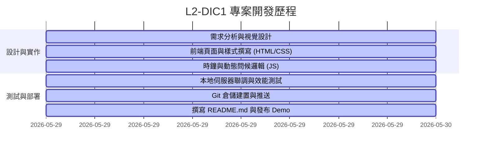

# 📊 專案開發工作報告 (Project Development Report)

## 1. 專案概述 (Project Overview)
本專案為 **L2-DIC1 (Ian's Live DateTime Landing Page)** 個人化首頁之開發計畫。目標是建立一個兼具視覺美感與實用功能的高質感動態時間展示網頁，展示開發者個人資訊及即時動態時間。

* **專案網址 (GitHub)**：[ian0629082/L2-DIC1](https://github.com/ian0629082/L2-DIC1)
* **展示網址 (Live Demo)**：[https://ian0629082.github.io/L2-DIC1/](https://ian0629082.github.io/L2-DIC1/)

---

## 2. 技術架構與設計系統 (Technology & Design)

### 🧱 技術棧
* **結構 (Structure)**：語意化 HTML5，優化 SEO 與響應式佈局。
* **樣式 (Styling)**：原生 CSS3 (Vanilla CSS)，採用彈性盒（Flexbox）、自訂變數（CSS Variables）與 CSS 動畫（Keyframes）。
* **邏輯 (Logic)**：原生 JavaScript (ES6+)，完全不依賴外部第三方套件，確保輕量、高效與秒載入體驗。

### 🎨 視覺與互動設計
1. **磨砂玻璃效果 (Glassmorphism)**：使用 `backdrop-filter: blur()`，結合半透明白色邊框與背景陰影，呈現極具現代感的卡片介面。
2. **動態霓虹光效 (Ambient Glow)**：背景設計了兩個緩慢浮動且不斷變色的霓虹圓球，帶來沉浸式的視覺層次感。
3. **微互動動態 (Micro-interactions)**：對所有互動按鈕加上平滑的 `transition` 縮放與漸變效果，提升用戶操控的實體感。

---

## 3. 核心功能實作說明 (Key Features)

| 功能模組 | 技術實現細節 | 效益 |
| :--- | :--- | :--- |
| **動態問候語** | 根據系統時間的小時數（`getHours()`），自動判定並切換「早上好」、「下午好」或「晚上好」等客製化問候。 | 提升使用者體驗與親切感。 |
| **即時秒級時鐘** | 透過 `setInterval` 實作每 1000 毫秒更新一次的數位時鐘。 | 保證時間顯示精準無誤。 |
| **動態序數日期** | 撰寫邏輯處理日期的序數尾碼（如 `1st`, `2nd`, `3rd`, `4th` 等）。 | 呈現更符合英文語法的精緻日期格式。 |
| **時制切換系統** | 利用狀態變數控制，允許使用者一鍵切換 12 小時制（AM/PM）與 24 小時制。 | 提供彈性的個人偏好設定。 |

---

## 4. 開發歷程與里程碑 (Milestones)

1. **規劃與視覺定調**：確定採用 Dark Mode（暗色主題）與玻璃擬態視覺風格。
2. **模組化程式碼撰寫**：
   - 完成 `index.html` 結構宣告。
   - 完成 `index.css` 核心設計系統。
   - 完成 `app.js` 時鐘邏輯與時制切換功能。
3. **本地聯調**：使用 `npx http-server` 於 Port `8080` 進行本地預覽與除錯。
4. **雲端部署**：
   - 建立並關聯 GitHub 遠端儲存庫。
   - 將程式碼推送到 GitHub 進行託管，並完成 `README.md` 說明文件撰寫。

---

## 5. 專案成果與效益評估
* **效能極佳**：專案全部採用原生網頁技術，無冗餘框架負載，首頁加載速度達毫秒級。
* **高質感視覺**：成功的 Glassmorphism 實作與微動態，相較於傳統時鐘網頁更具現代美感。
* **程式碼維護性**：HTML、CSS、JavaScript 三者職責分離（Separation of Concerns），邏輯清晰。

---

## 6. 未來展望
* **國際化 (i18n)**：預計未來加入多國語言切換（如繁體中文、英文、日文）。
* **背景自訂功能**：允許使用者上傳自訂背景，或從 Unsplash API 隨機獲取高畫質壁紙。
